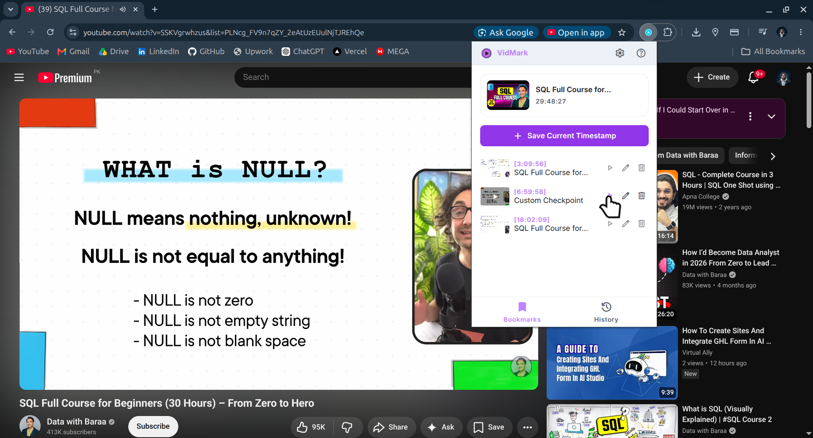
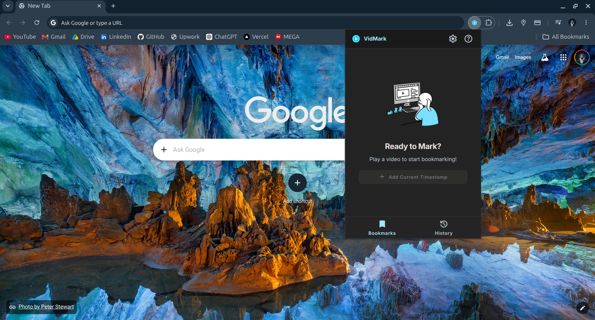
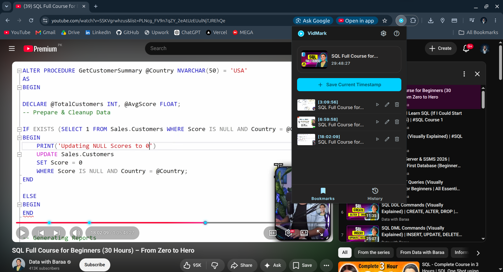
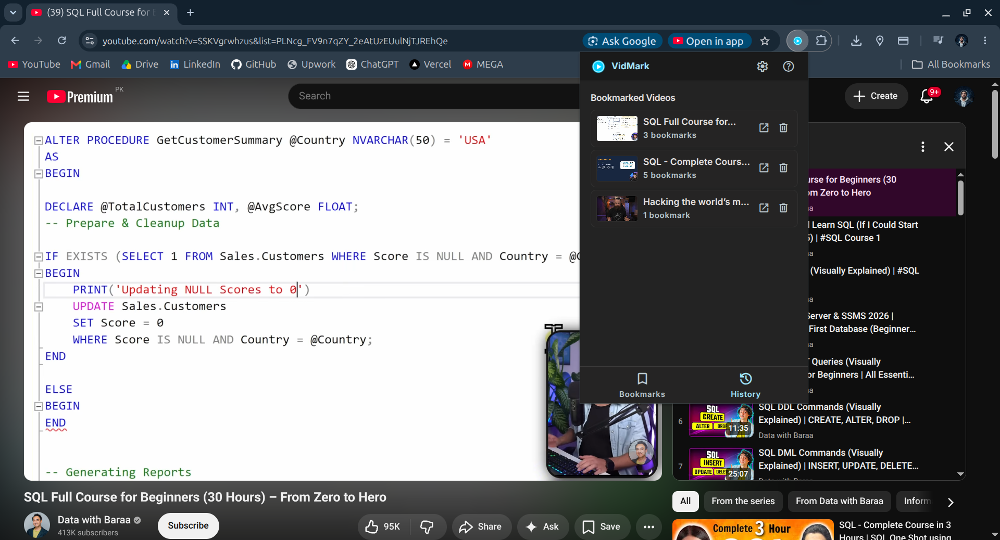
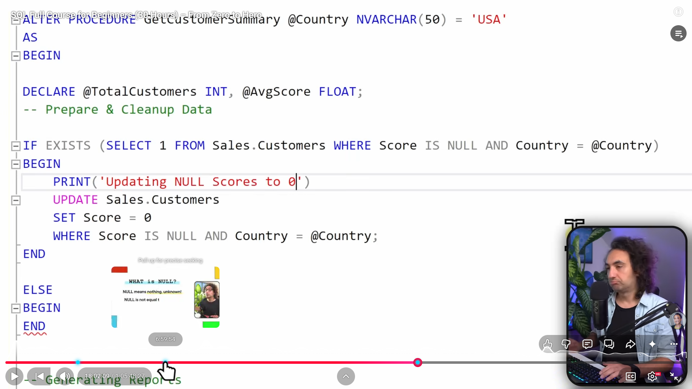
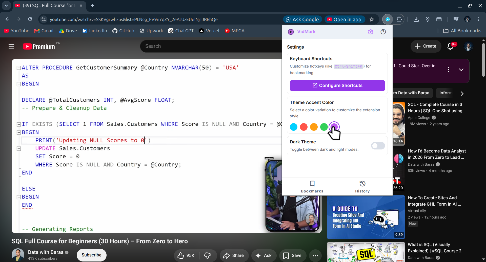
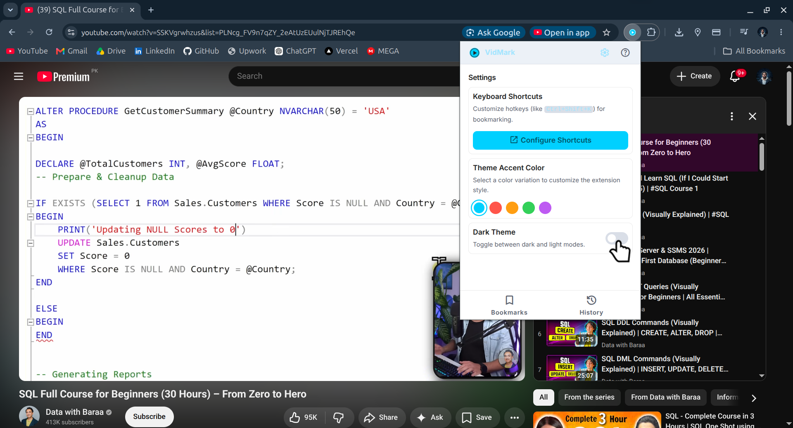
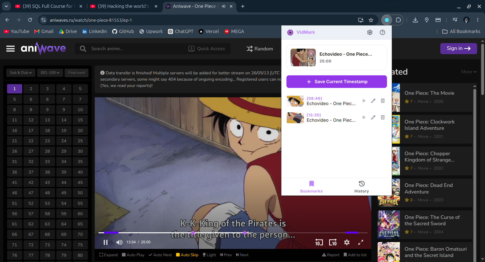
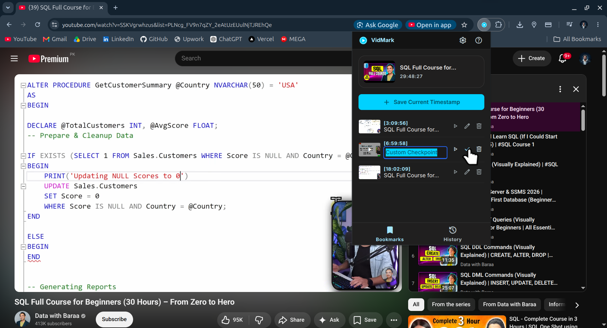
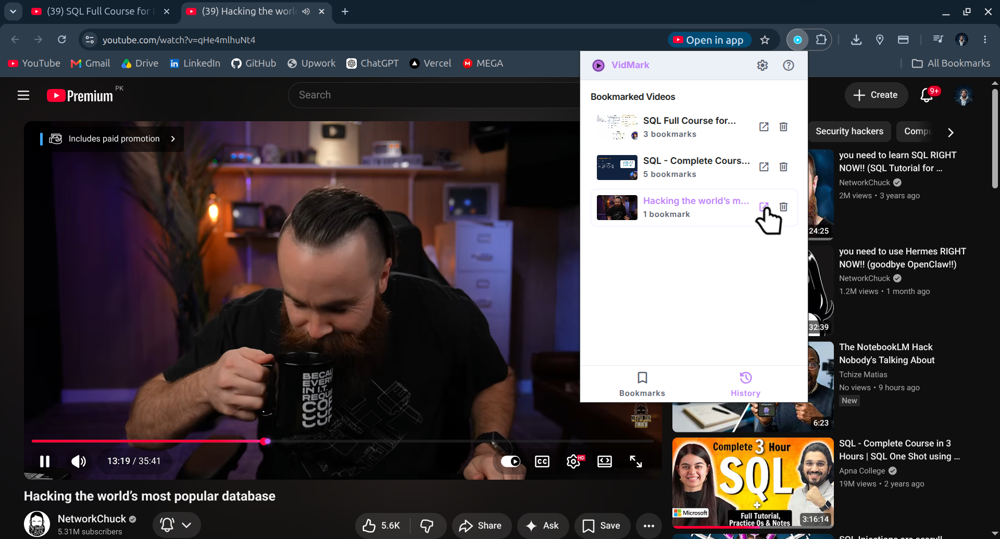

  
  
  # 🎥 VidMark
  
  
  

**A high-performance, universal video bookmarking Chrome extension designed for developers, learners, and creators who need to annotate and navigate video timestamps seamlessly.**

---

## 🎥 See it in Action

---

## ✨ Key Features

- **Universal Video Support:** Bookmark and annotate timestamps on YouTube, Vimeo, DPlayer, and any native HTML5 video player.
- **Precision Timeline Checkpoints:** View interactive checkpoint dots placed directly on the video player's native progress bar.
- **Dynamic Resize Support:** Progress bar checkpoints realign instantly when switching between normal, theater, and fullscreen modes.
- **Smart Frame Detection:** Auto-registers the active video using score-based frame detection (ignores background ad clips, sidebar list elements, and hover previews).
- **Customizable Themes:** Accent styling with HSL theme color presets (Cyan, Red, Orange, Green, Purple) in full Light and Dark mode options.
- **Quick-Mark Hotkey:** Press `Ctrl+Shift+K` (or `Cmd+Shift+K` on Mac) to bookmark the current timestamp instantly, capturing a clean video frame canvas snapshot.
- **History Tracking & Redirection:** Access recently bookmarked videos from any tab and jump straight to their saved timestamps.
- **Local Storage Isolation:** Your toggles, preferences, active theme, and bookmarks are saved securely and locally across browsing sessions.

---

## 📸 Visual Tour

Here is a closer look at what VidMark can do:

### 
*The main bookmarks view in its clean, empty state ready to detect active video media.*

### 
*Bookmarked video timestamps render with details, thumbnails, and quick actions.*

### 
*Keep track of recently bookmarked videos across different sites and domains.*

### 
*Visual checkpoints placed directly on the player timeline, showing exactly where you bookmarked.*

### 
*Switch theme accents instantly to fit your browsing preferences (Cyan, Red, Orange, Green, or Purple).*

### 
*Seamless theme toggles matching light and dark system settings.*

### 
*Works universally on custom HTML5 players across different video streaming sites.*

### 
*Edit and annotate bookmark notes inline without interrupting your playback.*

### 
*One-click redirection to open any bookmarked video directly at the correct seek position.*

---

## 🚀 How to Use

1. **Install VidMark:** Load the extension folder in Developer Mode via `chrome://extensions`.
2. **Open a Video:** Play a video on YouTube, Vimeo, or any supported streaming site.
3. **Save Bookmarks:** 
   - Click the **Add Current Timestamp** button in the popup.
   - OR use the hotkey: `Ctrl+Shift+K` (Windows/Linux) or `Cmd+Shift+K` (Mac).
4. **Annotate & Navigate:** Type inline notes for any bookmark, click the play button next to it to seek the player, or manage list items from the History tab.

---

## 🛠️ Built With

- [JavaScript](https://developer.mozilla.org/en-US/docs/Web/JavaScript) - Core Extension Logic
- [Tailwind CSS](https://tailwindcss.com/) - Premium UI Design
- [Chrome Extension API](https://developer.chrome.com/docs/extensions) - Tabs, Scripting, and Storage Integrations

---

## 👨‍💻 About the Author

"Hi, I'm Hashir! 👋 I'm passionate about building tools that make developers' lives easier. If you find this extension helpful in your workflow, I'd love to connect with you!"

- **GitHub:** [@hashirsajid58200p](https://github.com/hashirsajid58200p)
- **LinkedIn:** [linkedin.com/in/hashirsajid](https://www.linkedin.com/in/hashirsajid)

---

  <em>Created with ❤️ by Hashir Sajid</em>

